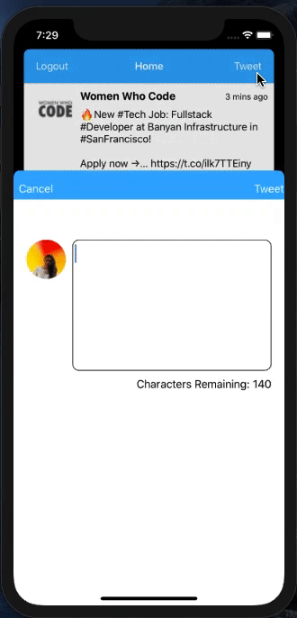

# Twitter - Part II

This is a basic twitter app to view, compose, favorite, and retweet tweets.

Time spent: **6** hours spent in total

## User Stories

The following **required** functionality is completed:

- [X] User can compose a tweet. (4pts)
- [X] User can favorite a tweet. (4pts)
- [X] User can retweet a tweet. (2pts)

The following **bonus** features are implemented:

- [X] When composing a tweet, user sees a countdown for the number of characters remaining for the tweet (out of 280) (2pts)
- [ ] User can view their profile in a profile tab. (3pts)
- [ ] User sees embedded images in tweet if available. (3pts)
- [X] Display how old a tweet is
- [X] Display count of retweets and favourites next to icons

## Video Walkthrough

Here's a walkthrough of implemented user stories:

# Twitter - Part I

**Twitter-App** is a basic twitter app to read your tweets.

Time spent: **3** hours spent in total

## User Stories

The following **required** functionality is completed:

- [X] User sees app icon in home screen and styled launch screen. (1pt)
- [X] User can log in. (1pt)
- [X] User can log out. (1pt)
- [X] User stays logged in across restarts. (1pt)
- [X] User can view tweets with the user profile picture, username, and tweet text. (6pts)

The following **bonus** features are implemented:

- [X] User can pull to refresh. (1pt)
- [X] User can load past tweets infinitely. (2pts)

## Video Walkthrough

Here's a walkthrough of implemented user stories:

.gif)

.gif)

## Update

- Added demo showing "User stays logged in across restarts" behaviour.

.gif)
